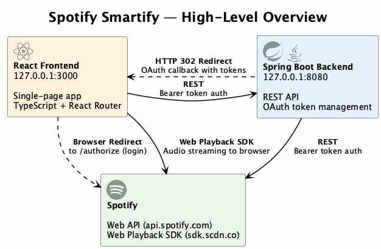

# Spotify Smartify

Full-stack Spotify application with OAuth authentication, a top tracks viewer, and a playlist quiz game.

React + TypeScript frontend, Spring Boot backend, Spotify Web API and Web Playback SDK.

## Architecture



> See [docs/architecture.puml](docs/architecture.puml) for detailed component, auth flow, and navigation diagrams.
>
> Regenerate PNGs: `plantuml docs/architecture.puml -o .`

## Project Structure

| Directory | Description |
|---|---|
| [spotify-smartify-be](spotify-smartify-be/) | Spring Boot backend — OAuth, REST API, Spotify integration |
| [spotify-smartify-fe](spotify-smartify-fe/) | React + TypeScript frontend — SPA with Spotify Web Playback SDK |
| [docs](docs/) | Architecture diagrams (PlantUML) |

## Quick Start

1. Set up Spotify credentials (see [backend README](spotify-smartify-be/README.md#environment-variables))
2. Start the backend:
   ```bash
   cd spotify-smartify-be
   ./mvnw spring-boot:run
   ```
3. Start the frontend:
   ```bash
   cd spotify-smartify-fe
   pnpm install
   pnpm start
   ```
4. Open http://127.0.0.1:3000

## Documentation

- [Backend README](spotify-smartify-be/README.md) — API endpoints, environment variables, setup
- [Frontend README](spotify-smartify-fe/README.md) — pages, configuration, running tests
